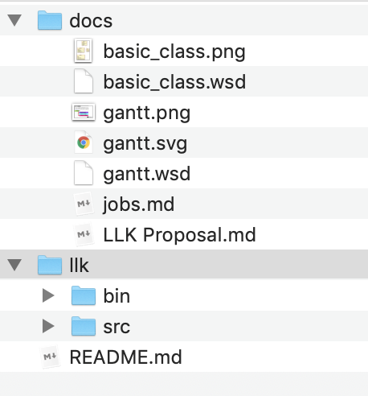

# Limited Linked Kindergarten

## Setting up Workspace

Operations in this section happens only when you are trying to work on this project on a new device. All steps are performed in `master` branch.

Clone this repo and move `llk` folder out of the whole repository.

```shell
git clone https://github.com/KevinRSX/Limited-Linking-Kindergarten
```

Then, open eclipse and use `your-path-to-Limited-Linking-Kindergarten/` (for example, `~/Desktop/Limited-Linking-Kindergarten`) as your eclipse workspace of this project. 

Create a project and name it as `llk`. DO NOT USE OTHER NAMES. Add JUnit5 and whatever libraries you need.

Drag everything inside `llk/src` into the `src` in eclipse project explorer. Then, clean everything outside `llk/src/` so that the repository look something like this.



Note that `/llk/bin` is already ignored by git.


## Working

Before changing anything, remember to

```shell
git pull
```

or

```
git pull origin master
```

to update the change of codes. After pulling, modifications from other members will be updated to your local machine. You don't need to move `llk` outside this time. Open eclipse, do some work, and push to GitHub. Only source code will be changed.

We may consider using [branch](https://git-scm.com/book/en/v2/Git-Branching-Basic-Branching-and-Merging) in the future.

