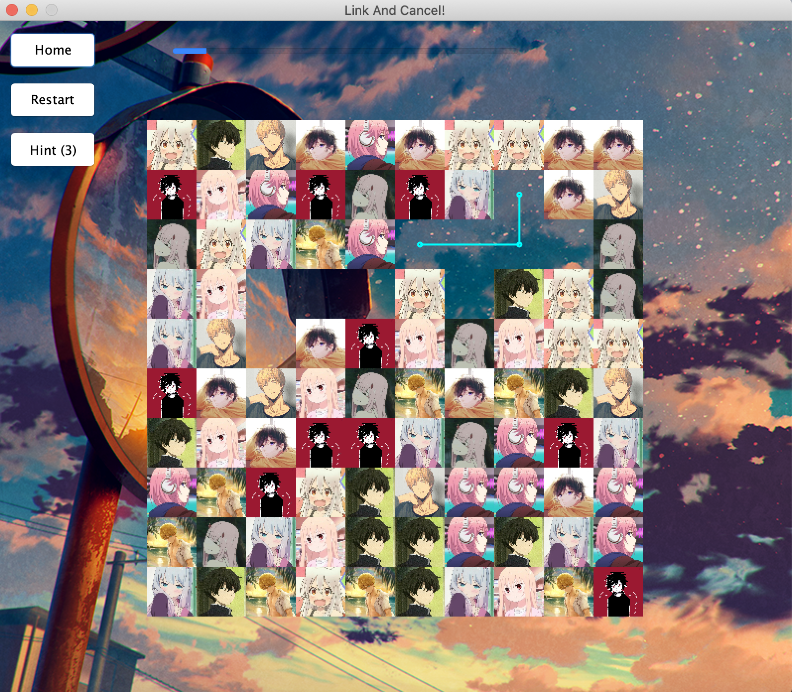

# Limited Linked Kindergarten

This is the course project of City University of Hong Kong's *CS3343 Software Engineering Practice*.

To know how to build/instal/ this project, see [installation guide](https://github.com/KevinRSX/Limited-Linking-Kindergarten/tree/master/docs/installation_guide.md).

To know more about the rules guidlines of the graphic users' interface, see [user manual](https://github.com/KevinRSX/Limited-Linking-Kindergarten/blob/master/docs/User%20Manual.md).

Contributors:

- Ruikang Li (project management, main workflow)
- Deheng Zhang (GUI design, main workflow, class diagram, sequence diagram, use case diagram & specification)
- Kaiwen Xue (game board, linking algorithm, beautification)
- Zelin Ning (scoreboard, project plan)
- Chengyu Sun (timer)
- Qihua Dong (linking algorithm, testing)