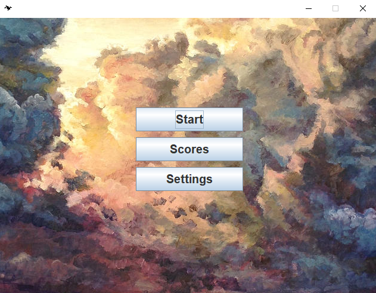
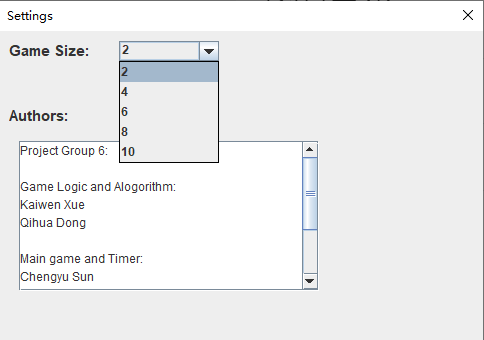
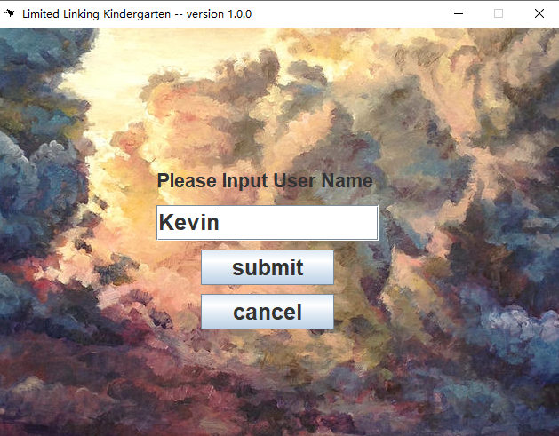
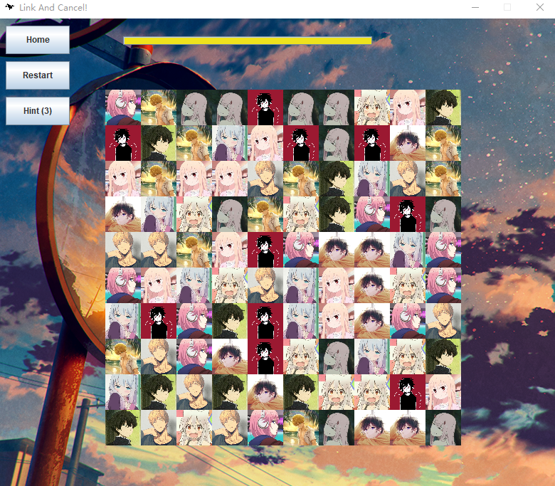
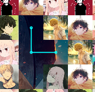
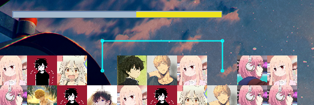
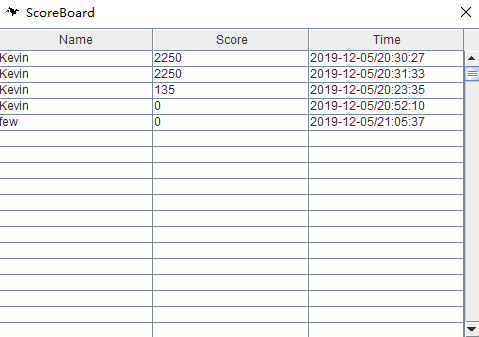

# Limited Linking Kindergarten -- User Manual

## User Manual

All demonstrations are performed on Windows, but the process are the same on other operating systems.

After starting the game, you will see three buttons directing you to three different pages. Normally, a player may want to go to `settings` first to set the number of grids he/she wants to have for a game (which is also the difficulty level of the game).

In `settings` you can use the scrolling panel to choose the game size. Say that you want a game of size 10 * 10, you should choose 10 for game size. We welcome you to read the information of the authors listed below.

The `scores` button will show the scoreboard. We shall demonstrate its effects at the end.

`Start` button directs you to the game. You will first need to input your nickname used for recording your final score.

After submitting your nickname, you can start playing.

Click on a pair of grids of the same type to cancel them. Try to do it as fast as you can! Note that you can only cancel grid A and grid B if A can find a path to B by drawing no more than 3 lines (making 2 turns).

For example, you can make no turns,

one turn, 

or two turns.

Otherwise they cannot be cancelled. For example the "zero two" character on the row 1, column 6 and row 2, column 7 cannot be cancelled directly as there is no such path leading from on to the other.

The timeline on the top shows how much time is left. If the time is used up, you will fail.

Buttons on the top-left corner:

- `home`: return to home screen
- `restart`: restart the game
- `hint`: show cancellable grids. You can use it for at most three times. Be wise!

When you finish the game, either you fail or succeed, you can view the scoreboard by pressing the `score` button:

The score is calculated based on how many grids you have cancelled, how much time is left, and how many hints have not been used. Have fun!